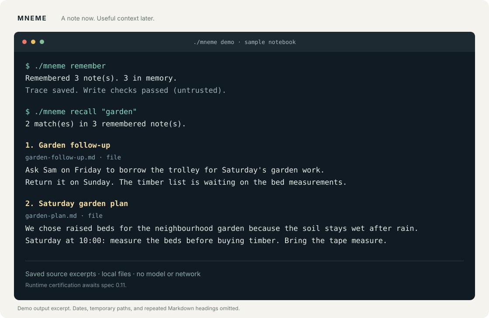

# Mneme

**Keep a decision today. Find the reason next week.**

MNEME is a Personal AI OS memory system. Its current usable slice is a
local command-line memory for your own notes: capture something worth
keeping, explicitly remember it, and recall the saved words later. It
runs offline, with deterministic prompt stand-ins and no model API keys.

## Try it

From a clone of this repository, with **Bun 1.3.11 or newer**:

```sh
bun install --cwd helix
./mneme demo
```

The demo remembers sample notes and recalls their context in a temporary
profile. Your own memory stays in its own profile.



<details>
<summary>Demo transcript (excerpt)</summary>

```text
$ ./mneme remember
Remembered 3 note(s). 3 in memory.
Trace saved. Write checks passed (untrusted).

$ ./mneme recall "garden"
2 match(es) in 3 remembered note(s).

1. Garden follow-up
   Ask Sam on Friday to borrow the trolley for Saturday's garden work.
   Return it on Sunday. The timber list is waiting on the bed measurements.

2. Saturday garden plan
   We chose raised beds for the neighbourhood garden because the soil stays wet after rain.
   Saturday at 10:00: measure the beds before buying timber. Bring the tape measure.
```

This excerpt omits source metadata, repeated Markdown headings, and
temporary paths. The runnable demo also shows a quoted phrase search
and prints a command to query its temporary profile yourself.

</details>

## Your daily loop

```sh
# During the day: save a decision, a follow-up, or a useful detail.
./mneme capture "Desk setup: chose the north wall to avoid afternoon screen glare."
./mneme capture "Weekend: return the borrowed camping stove on Sunday."

# When ready: commit your inbox through the declared memory graphs.
./mneme remember

# Later: get the saved words back, with their source and date.
./mneme recall "screen glare"
./mneme recent --days 7
```

`capture` puts a note in your inbox; **`remember` makes it memory**.
Recall searches saved titles, headings, keywords, and excerpts and
returns an exact excerpt of up to 1,200 characters. It helps recover
what you wrote; it does not generate answers or infer new facts.

Use `./mneme status` to see your profile and `./mneme doctor` to check
setup. Markdown inboxes and sensory buffers are supported too. See the
[daily usage guide](helix/DAILY.md) for commands, storage, date filters,
and the existing Claude Code adapter.

## What is implemented

The underlying **Helix** scheduler interprets the checked-in
`spec/kernel.json`. Notes pass through the declared sensory → working →
long-term paths; recall runs the declared read path. Each long-term
write consumes its own Core permit, and runs emit an inspectable
`mneme.trace/v1`. A deterministic anomaly scan quarantines matching
secret patterns before they enter memory.

The Core store is currently empty. Permits are enforced, but there are
no personal constitution clauses to evaluate. Prompt stand-ins are
offline approximations, and the secret scan only detects its known
patterns. This is an early, useful slice of the memory system.

**Certification scope: judged and certified static only.** The steward
accepted the kernel IR's `Mneme.Certificate`; no runtime certificate has
been accepted. The daily path does not run ADL or DEM, and their temporal
requirements remain unmet. Full runtime certification is blocked on the
undeclared `tau` in spec 0.10 and awaits a steward-issued 0.11 pack.
Passing TypeScript checks is not a Lean proof. See
[the judge and certification notes](helix/JUDGE.md).

The full design has four layers (sensory, working, long-term, Core),
transitions as enumerable prompt graphs, and digital twins as installed
partitions under human-owned Core. Twins, DEM, ADL, and a chat or explorer
UI remain outside this implementation slice. The canonical target is
the read-only, checksummed **mneme.spec/0.10** pack in [spec/](spec/).

## Contributing

Read [AGENTS.md](AGENTS.md), then follow the load order in
[spec/README.txt](spec/README.txt). Core semantics, capability tokens,
twin installs, frozen surfaces, and certificate acceptance are
steward-held. Never edit the canonical spec pack in place.

Run the complete checks from the repository root:

```sh
./scripts/verify-spec.sh
(cd helix && bun install && bun test && bun run typecheck)
bun helix/src/judge.ts
./scripts/sync-lean.sh
(cd proofs && lake build)
./scripts/verify-spec.sh
```

Lean uses the pinned 4.33.1 toolchain via elan. For a fresh development
environment, [scripts/bootstrap.sh](scripts/bootstrap.sh) installs the
pinned toolchain and dependencies; `--full` also builds the proofs.

| Path | Purpose |
| --- | --- |
| [helix/DAILY.md](helix/DAILY.md) | Daily command-line usage and storage. |
| [helix/DOGFOOD.md](helix/DOGFOOD.md) | Lower-level tray CLI, scope, and feedback. |
| [helix/ADAPTER.md](helix/ADAPTER.md) | Optional Claude Code sensory adapter. |
| [helix/](helix/) | TypeScript scheduler, local memory, and tests. |
| [spec/](spec/) | Canonical brief, kernel IR, Lean laws, and prompt corpus. |
| [proofs/](proofs/) | Lean certificates and attack regressions. |
| [CONTEXT.md](CONTEXT.md) | Non-normative briefing for tool-less chat agents. |
